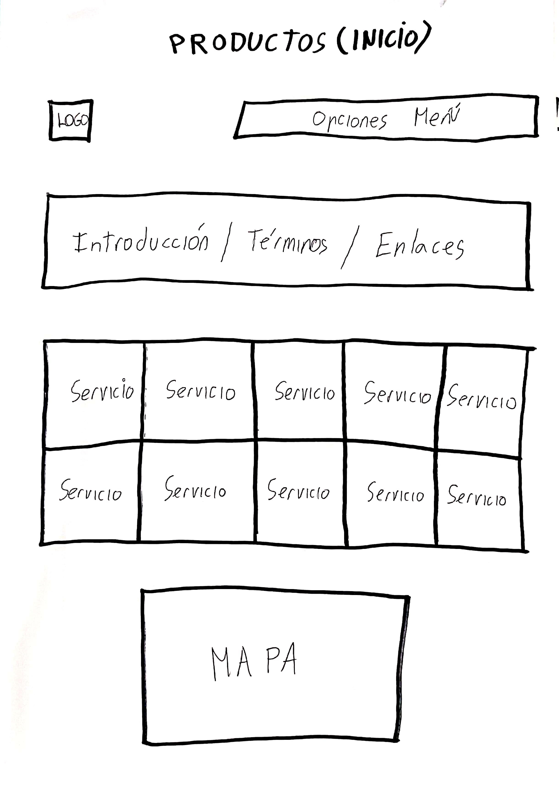
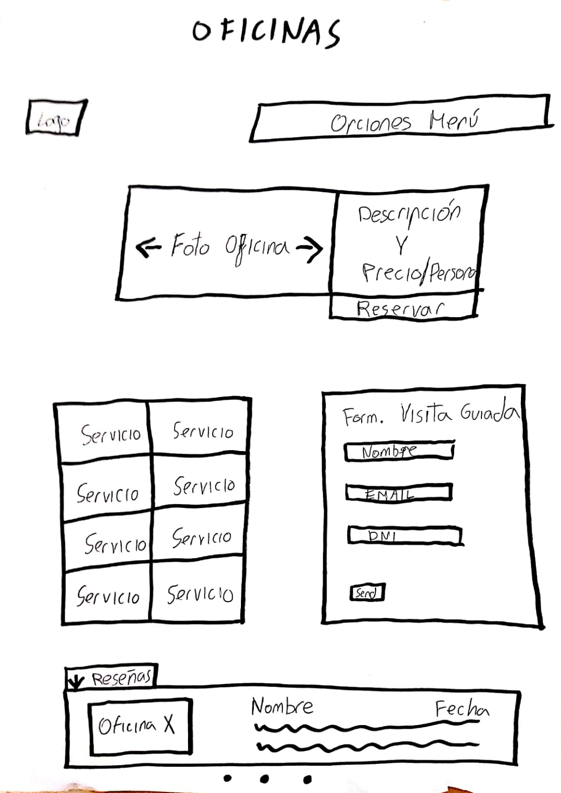
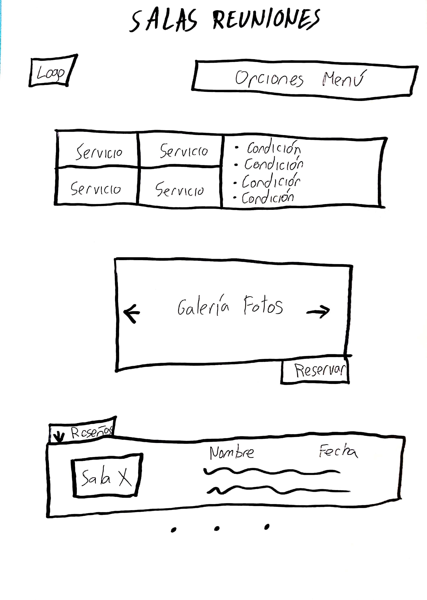

# Actividad Final Teoría 

Mario Genol Morales.  Curso: 2019/20 

Proyecto: Cubikate

Descripción: Cubikate es una empresa que dispone de oficinas de trabajo colaborativo (Coworking). Un nuevo concepto con mucho potencial en el mundo empresarial.

* :bust_in_silhouette:   Mario Genol Morales     :octocat:     

# Introducción

El coworking o trabajo cooperativo consiste en una forma de trabajo en la que profesionales independientes comparten un mismo espacio de trabajo con el fin de desarrollar sus proyectos profesionales de manera independiente, a la vez que fomentan proyectos conjuntos.

En este proyecto se va a llevar a cabo un rediseño de una página web centrada en el coworking, “Cubikate”. En él, se van a aplicar técnicas y metodologías de diseño centrado en usuario y UX.

Para el desarrollo del mismo se tendrán en cuenta aspectos como la claridad, la consistencia o la usabilidad, entre otros.

Personalmente, me ha parecido realmente interesante el tema de accesibilidad abarcado en la asignatura, y he querido enfocar el proyecto a ello. Es por ello que se va a utilizar una persona con problemas de visión.
 

# Proceso de Diseño 

## Paso 1. UX Desk Research & Analisis 

 1.a Competitive Analysis
-----
Tras analizar diferentes sitios web de empresas del sector, como:

https://www.be-working.com/

https://laaduanacoworking.com/

https://ecolaboralcoworking.com/

Hemos sacado algunas conclusiones. Por ejemplo, la gran mayoría utilizan un formato muy similar, siendo los menús idénticos en alguna ocasión. Un punto negativo de la web que estamos analizando es que todas las demás tienen toda una sección dedicada a precios. Por lo que los usuarios se ahorrarían bastante tiempo y podrían elegir otra.

Además, en este tipo de web se le da gran importancia a las valoraciones de sus clientes, llegando a contar algunas hasta con videos de opiniones. Sin duda este tiene que ser un punto a resolver en Cubikate.

 1.b Persona
-----
Nuestra persona, Marta Molina:

He elegido a esta persona ya que creo que se adapta muy bien por el tipo de trabajo y la personalidad, y además cuenta con el añadido de que tiene problemas de visión. Este es un problema más común de lo que pensamos, por lo que puede ayudar incluso un poco más al desarrollo del diseño.

 1.c User Journey Map
----

Creo que el Journey Map confeccionado se adapta bastante bien a lo que sería un transcurso normal de los hechos. Cualquier usuario con poco conocimiento del tema puede sufrir estos contratiempos.

 1.d Usability Review
----
* Enlace a la revisión de usabilidad: [Usabilidad](https://github.com/MarioGenol/DIU20/blob/master/ActividadFinal/Usability-review.xlsx)

Puntuación: 73 (Good)

La aplicación presenta un diseño cuidado e intuitivo, el cual nos presenta la información con multitud de imágenes desde la pantalla inicial hasta cualquier sección de la web, que hacen que la experiencia de uso de la aplicación sea realmente atractiva.

La página cumple con lo que pretende, que es dar información acerca del sitio. Sin embargo, se deja muchas funcionalidades por el camino. Lo primero y más importante, es que el feedback de los clientes es prácticamente nulo. Cuenta con 2 opiniones que además estás editadas por la misma web. Esto es un gran factor de disuasión de clientes.

Por otro lado, también podemos destacar negativamente que no tiene ninguna herramienta de búsqueda o que no pesee links a páginas externas que pudieran ser relevantes, como para explicar el termino "coworking", nuevo para muchos usuarios.

Sin embargo, se pueden señalar algunos aspectos positivos que sería interesante conservar para el rediseño. Tenemos que la estructura de la página es muy intuitiva para el usuario. Junto con los menús, hacen muy sencillo navegar por la misma. Lo que es más, la paleta de colores usada es 100% válida y atractiva.

## Paso 2. UX Design  

 2.a Feedback Capture Grid
----
Tras haber analizado la web obtenemos lo siguiente: 

Teniendo eso en cuenta, se pretende realizar una propuesta de valor, la cual implemente el diseño final. Esta consiste en la construcción de una sección de reseñas por oficina o sala de reuniones, ya que por la información de la web no podemos saber ni de cuantas salas disponen, ni de lo que los usuarios opinan de cada una de ellas, al igual que tampoco se valora lo esencial de este producto, el ambiente de trabajo.

  
 2.b Sitemap 
-----

Aquí se ha realizado un pequeño sitemap de lo que se quiere conseguir. Un rediseño que va a conservar los puntos fuertes de diseño, y además va a incorporar elementos de enorme utilidad para el usuario.

 2.d Wireframes
-----

El diseño de la portada complementa el diseño del que se partía añadiendo unos pequeños detalles como pueden ser la explicación de términos poco conocidos por los usuarios menos experimentados. Además también se propone que se añadan diversos enlaces a páginas externas relacionadas y de caracter informativo. 

Aquí lo primero que destaca es la aparición de una galería de fotos de diferentes oficinas, a las cuales, a parte de añadirles una descripción y precio por persona, también se proporciona el botón de reservar, donde redirigiría a la sección pertinente para completar la compra. Finalmente se añade el tan comentado apartado de valoraciones.

Este apartado es bastante similar al anterior, destacando la galería y el apartado de reseñas. Tambíén se da visibilidad a las condiciones de uso de la sala.

Estos bocetos que representan lo que posteriormente sería la web, se han confeccionado en base a las necesidades y carencias que se han determinado en las secciones anteriores.
