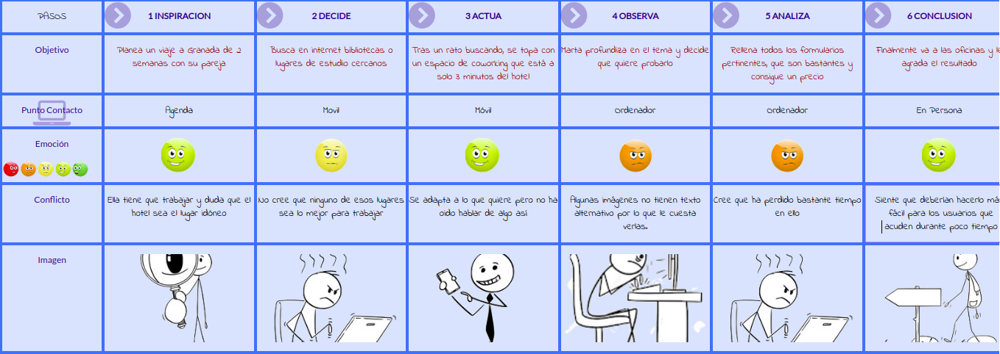
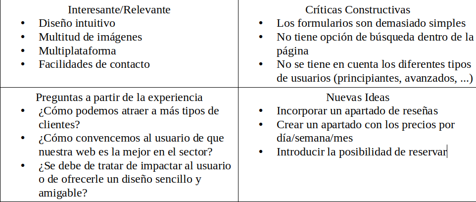

# Actividad Final Teoría 

Mario Genol Morales.  Curso: 2019/20 

Proyecto: Cubikate

Descripción: Cubikate es una empresa que dispone de oficinas de trabajo colaborativo (Coworking). Un nuevo concepto con mucho potencial en el mundo empresarial.

* :bust_in_silhouette:   Mario Genol Morales     :octocat:     

# Introducción

El coworking o trabajo cooperativo consiste en una forma de trabajo en la que profesionales independientes comparten un mismo espacio de trabajo con el fin de desarrollar sus proyectos profesionales de manera independiente, a la vez que fomentan proyectos conjuntos.

En este proyecto se va a llevar a cabo un rediseño de una página web centrada en el coworking, “Cubikate”. En él, se van a aplicar técnicas y metodologías de diseño centrado en usuario y UX.

Para el desarrollo del mismo se tendrán en cuenta aspectos como la claridad, la consistencia o la usabilidad, entre otros.

Personalmente, me ha parecido realmente interesante el tema de accesibilidad abarcado en la asignatura, y he querido enfocar el proyecto a ello. Es por ello que se va a utilizar una persona con problemas de visión.
 

# Proceso de Diseño 

## Paso 1. UX Desk Research & Analisis 

 1.a Competitive Analysis
-----
Tras analizar diferentes sitios web de empresas del sector, como:

https://www.be-working.com/

https://laaduanacoworking.com/

https://ecolaboralcoworking.com/

Hemos sacado algunas conclusiones. Por ejemplo, la gran mayoría utilizan un formato muy similar, siendo los menús idénticos en alguna ocasión. Un punto negativo de la web que estamos analizando es que todas las demás tienen toda una sección dedicada a precios. Por lo que los usuarios se ahorrarían bastante tiempo y podrían elegir otra.

Además, en este tipo de web se le da gran importancia a las valoraciones de sus clientes, llegando a contar algunas hasta con videos de opiniones. Sin duda este tiene que ser un punto a resolver en Cubikate.

 1.b Persona
-----
Nuestra persona, Marta Molina:

He elegido a esta persona ya que creo que se adapta muy bien por el tipo de trabajo y la personalidad, y además cuenta con el añadido de que tiene problemas de visión. Este es un problema más común de lo que pensamos, por lo que puede ayudar incluso un poco más al desarrollo del diseño.

 1.c User Journey Map
----

Creo que el Journey Map confeccionado se adapta bastante bien a lo que sería un transcurso normal de los hechos. Cualquier usuario con poco conocimiento del tema puede sufrir estos contratiempos.

 1.d Usability Review
----
* Enlace a la revisión de usabilidad: [Usabilidad](https://github.com/MarioGenol/DIU20/blob/master/ActividadFinal/Usability-review.xlsx)

Puntuación: 73 (Good)

La aplicación presenta un diseño cuidado e intuitivo, el cual nos presenta la información con multitud de imágenes desde la pantalla inicial hasta cualquier sección de la web, que hacen que la experiencia de uso de la aplicación sea realmente atractiva.

La página cumple con lo que pretende, que es dar información acerca del sitio. Sin embargo, se deja muchas funcionalidades por el camino. Lo primero y más importante, es que el feedback de los clientes es prácticamente nulo. Cuenta con 2 opiniones que además estás editadas por la misma web. Esto es un gran factor de disuasión de clientes.

Por otro lado, también podemos destacar negativamente que no tiene ninguna herramienta de búsqueda o que no pesee links a páginas externas que pudieran ser relevantes, como para explicar el termino "coworking", nuevo para muchos usuarios.

Sin embargo, se pueden señalar algunos aspectos positivos que sería interesante conservar para el rediseño. Tenemos que la estructura de la página es muy intuitiva para el usuario. Junto con los menús, hacen muy sencillo navegar por la misma. Lo que es más, la paleta de colores usada es 100% válida y atractiva.

## Paso 2. UX Design  

 2.a Feedback Capture Grid
----
Tras haber analizado la web obtenemos lo siguiente: 

Teniendo eso en cuenta, se pretende realizar una propuesta de valor, la cual implemente el diseño final. Esta consiste en la construcción de una sección de reseñas por oficina o sala de reuniones, ya que por la información de la web no podemos saber ni de cuantas salas disponen, ni de lo que los usuarios opinan de cada una de ellas, al igual que tampoco se valora lo esencial de este producto, el ambiente de trabajo.

  
 2.b Sitemap 
-----

Aquí se ha realizado un pequeño sitemap de lo que se quiere conseguir. Un rediseño que va a conservar los puntos fuertes de diseño, y además va a incorporar elementos de enorme utilidad para el usuario.

 2.c Labelling 
----

 2.d Wireframes
-----

# Paso 3. Case Study

¿Y si alquilar tu habitación fuera lo mejor que te ha pasado?

## Introducción
### Duración del proyecto

El proyecto ha durado 2 meses.

### Miembros del equipo
Han contribuido José Manuel López Molina y Mario Genol Morales.

### Objetivos
  Primarios
  
    * Contribuir a la sociedad con un sistema para ofrecer alojamiento de forma económica.
    * Desarrollar un sistema que englobe tanto alquiler de habitaciones y apartamentos.
    
  Secundarios
  
    * Contribuir a compartir cultura y vivencias.
    * Fomento del turismo en regiones no tan conocidas.

## Oportunidad
* Dispositivos Móviles: Con 8 mil millones de teléfonos en el mundo, las oportunidades de llegar al público a través de aplicaciones son muy grandes.
* Redes sociales: Actualmente la mejor forma de publicitación, promocionando tanto lugares como alojamientos. Contando con la difusión mundial que tendría trabajar con los conocidos como ‘influencers’.
* Promoción en puntos localizados: Posibilidad de centrar los esfuerzos de publicitación en puntos o ciudades concretas bajo demanda.

## Nuestros usuarios

 
 
Algunos de los comentarios de clientes han sido los siguientes:
* Paula Soto: ‘Airbnb es genial, todo lo que puedas desear en una página web’
* Mónica Castaño: ‘Me parece una página muy completa, pero demasiado simple para mi gusto’
* Juan Carlos Fernández: ‘Que se puedan comprar experiencias en el lugar de destino me ha ahorrado una barbaridad de tiempo’

### Conclusiones sacadas de nuestros usuarios

## Análisis de competencia

Tras analizar páginas web similares, hemos llegado a diversas conclusiones:

* Todas tienen diseños simples, con menús bastante limpios e intuitivos. Por lo que moverse por la página es bastante sencillo.
* En nuestra página no es posible ver el mapa del alojamiento antes de la compra, lo que sí pasa en otras webs.
* Todas las webs dejan claras todas las posibilidades que ofrecen en su página principal.

## Investigación Primaria

Hallazgos clave:
* La mayoría de usuarios realiza búsquedas de habitaciones en lugares turísticos.
* La mayoría de los usuarios es reacia a la hora de aportar datos sensibles.
* Algunos usuarios dudan de la fiabilidad y autenticidad de las ofertas que se realizan. 
* Muchos usuarios solicitan que los huéspedes reflejen los aspectos más relevantes de la vivienda (ya sean buenos o malos).
* La mayoría de usuarios desearía que las comunicaciones y los pagos fueran ambos, en su totalidad, a través de la app. Nada de correos externos, Whatsapp, Telegram, o plataformas alternativas. 

## Diseño Concentrado en el Usuario

Nos vemos en la necesidad de crear dos usuarios para identificar los objetivos y los puntos débiles de nuestro usuario objetivo. La razón por la que elegimos dos usuarios fue porque nos enfocamos en cómo al usuario se le presentaría la necesidad de utilizar una aplicación como la nuestra intencionadamente y sin intención.

Nuestro principal usuario voluntario, Juan Manuel:

Nuestro personaje secundario involuntario, Julio:

### Objetivos del usuario
Identificamos los objetivos del usuario en función de nuestros 2 usuarios:

* Los usuarios presentados como huéspedes necesitan ser reconocidos positivamente para distinguirse con respecto a otros (mediante evaluaciones y críticas positivas).
* Los usuarios representados como futuros inquilinos basan sus búsquedas en las críticas y evaluaciones citadas en el apartado anterior.
* Los futuros inquilinos no sólo solicitan un habitación para llevar a cabo actividades turísticas, sino que también hay casos en los que lo hacen por trabajo o por estudios.
* Ambos tipos de usuarios (huésped e inquilino) requieren la máxima transparencia posible en los datos que se ofrecen (vivienda, fechas, identidad, seguridad, etc).

### Puntos débiles del usuario

* Los usuarios inquilinos temen ser engañados por los huéspedes y alquilar una habitación que no es la que esperaban. 
* Muchos usuarios no logran ponerse de acuerdo con sus huéspedes o inquilinos.
* Generalmente muchos huéspedes no aportan toda la información íntegra sobre la vivienda, lo que lleva a futuras sorpresas por parte de los inquilinos.

### Journey Map

Nuestro usuario Juan Manuel, ante las ganas de enriquecer su vida y la de su mujer, inician el camino para alquilar una habitación a través de airbnb.

Por otro lado tenemos a nuestro usuario Julio, que en este caso tiene el rol de futuro inquilino, el cual se ve inspirado a buscar un alojamiento compartido debido a los precios elevados que encuentra en internet. Finalmente bajo recomendaciones de sus amistades, da con nuestra aplicación y decide alojarse en un piso con unos estudiantes que comparten habitación .

### Problemas que debemos evitar

* Dado que los usuarios son más propensos a notar los elementos cerca de la parte superior de la página, no debemos establecer los elementos de menor importancia en esta zona. 

* Es importante evitar que el usuario llegue a páginas que “no tienen salida”. El flujo termina en ellas y no hay manera de salir de ellas, solo volviendo hacia atrás. Causan confusión y crean trabajo adicional para los usuarios. 

* Evitar el realizar páginas del sitio web excesivamente largas, puesto que cuanto más larga es la página, menos probable es que alguien se desplace hacia abajo hasta el final.

* Evitar crearle la sensación al usuario de que el sitio web es lento. En caso contrario el usuario abandonará la web considerándola poco fiable.

### Cosas que debemos incluir

* La jerarquía de la web debe ajustarse como máximo a 3 o 4 niveles de profundidad.

* Usar menús fijos, especialmente en páginas web largas, que requieren un acceso rápido o que se apoyan mucho en la navegación. 

* Establecer una navegación consistente; no debería cambiar en todo el sitio web. Esto ayudará a que los usuarios siempre sepan dónde buscar las cosas y no se desorienten.

*Establecer etiquetas de navegación específicas, no más de 2-3 palabras, que sean clave y que transmitan la mayor cantidad de información posible.

* Usar listas desplegables de menús  verticales.

* Los enlaces en los sitios web deben destacarse: usar texto azul y/o subrayado para indicar hipervínculos.

*Establecer las acciones frecuentes como botones grandes ubicados en zonas accesibles.

## Patrones de diseño

Airbnb utiliza un patrón de diseño Fijo, que es aquél en el que se establecen como tamaño de la estructura unas medidas inalterables por el navegador. La misma compañía describe su diseño de la siguiente manera:

### Unificado

Cada pieza es parte de un todo mayor y debe contribuir positivamente al sistema a escala. No debe haber características aisladas o valores atípicos.

### Universal

Airbnb es utilizado en todo el mundo por una amplia comunidad global. Nuestros productos y nuestro lenguaje visual deben ser acogedores y accesibles.

### Icónico

Estamos enfocados cuando se trata de diseño y funcionalidad. Nuestro trabajo debe hablar con valentía y claridad sobre este enfoque.

### Conversacional

Nuestro uso del movimiento da vida a nuestros productos y nos permite comunicarnos con los usuarios de maneras fáciles de entender.

## Logotipo

Desde sus comienzos, la identidad adolecía de cierto amateurismo, tal y como explica Andrew Schapiro, director de diseño de Airbnb, el logo “fue creado sin una entendimiento real de lo que Airbnb era realmente”.

Se espera que el símbolo trascienda sus connotaciones de marca para convertirse en un signo que la gente adopte y comparta como representación de una filosofía.

## Tipografía

La tipografía utilizada a lo largo de toda la página web es conocida como Lineto. Una tipografía anodina que intenta no quitar protagonismo al resto de componentes. El uso de este tipo de letra nos parece bastante acertado y cumple perfectamente con su misión.

Además de esta tipografía, también nos hubiera parecido correcto el uso de ‘’Open Sans’’  dada la  suavidad del contorno , ya que se integra perfectamente en la simpleza que Airbnb quiere conseguir en su web.

