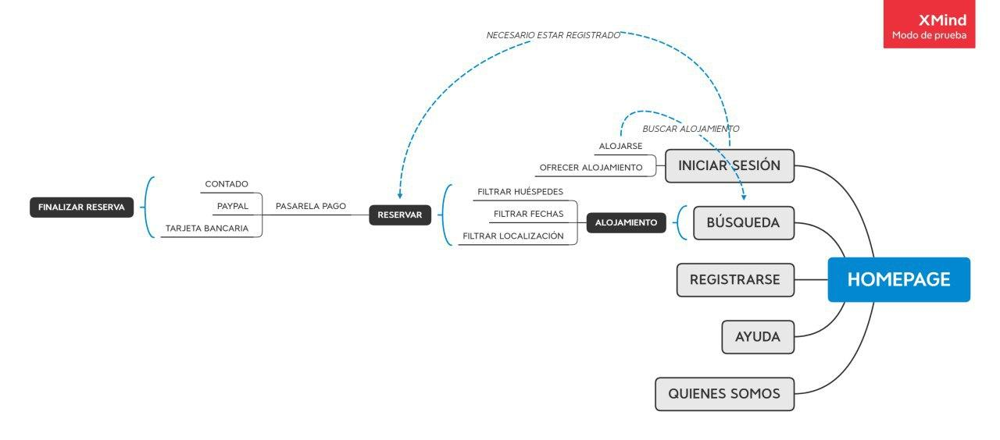
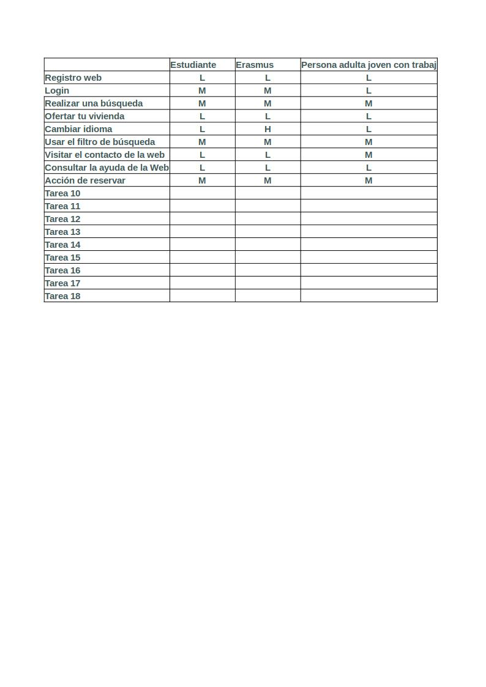
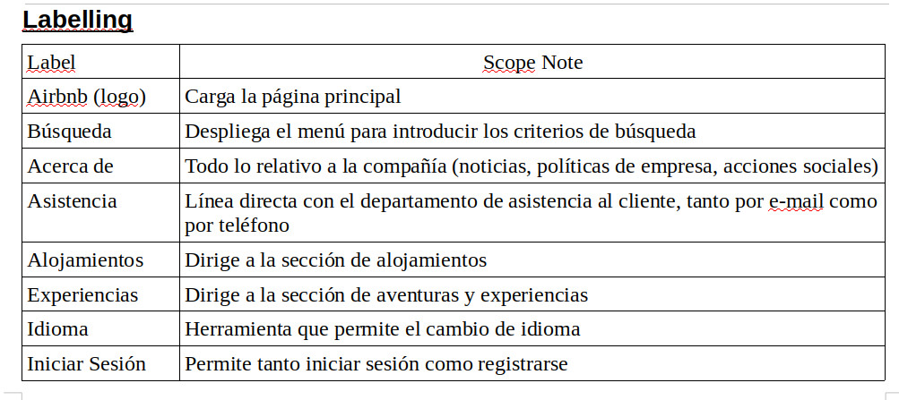
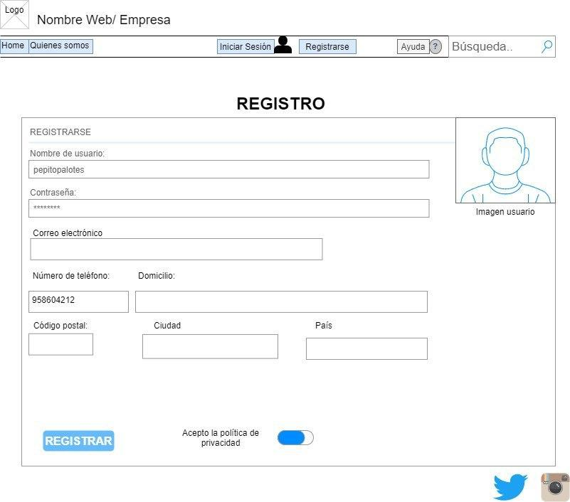
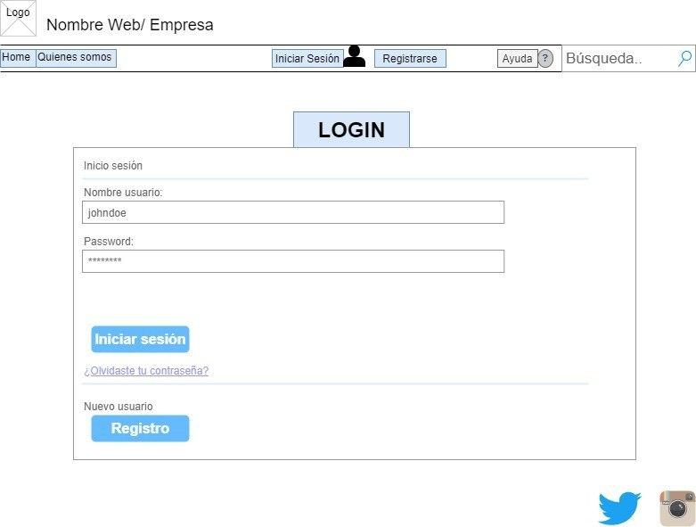
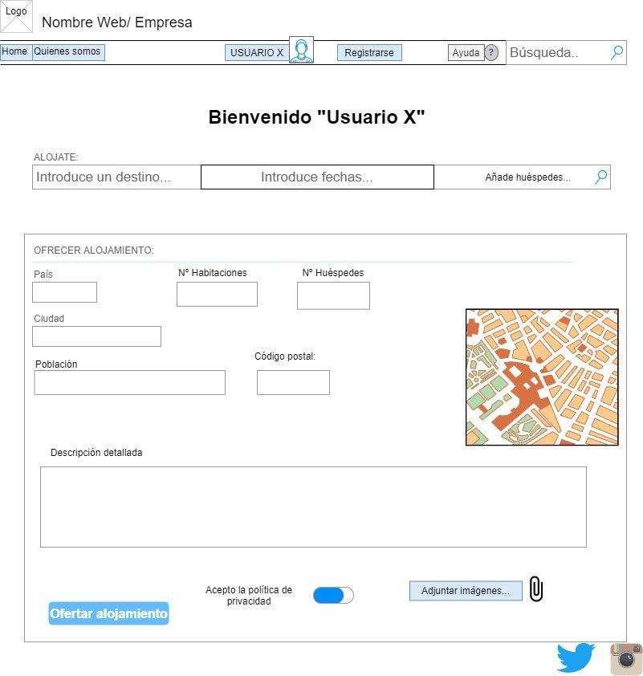
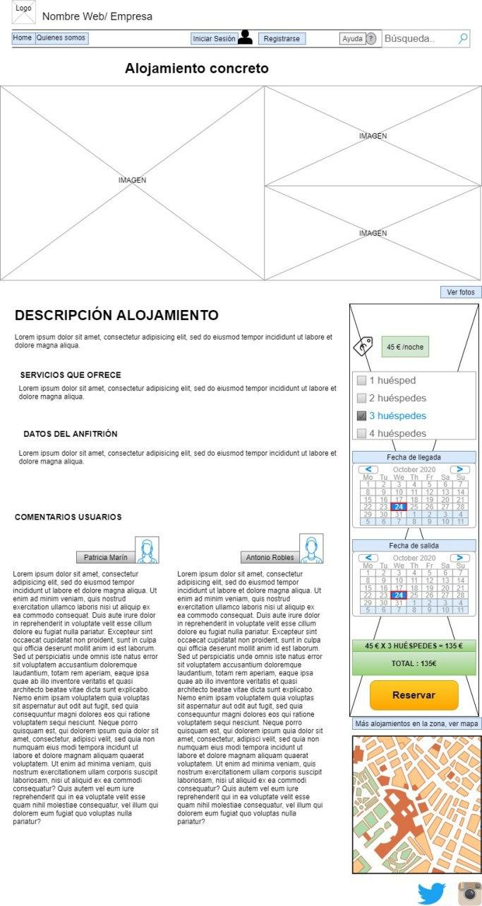
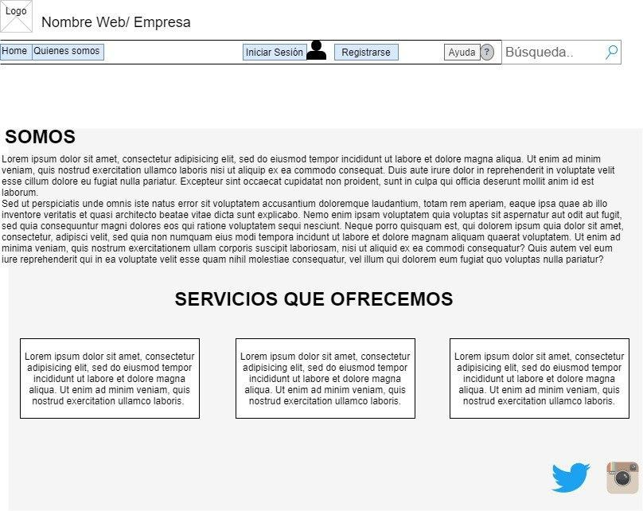

# DIU20 
Prácticas Diseño Interfaces de Usuario 2019-20 (Economía Colaborativa) 

Grupo: DIU2_M&J.  Curso: 2019/20 

Proyecto: Airbnb

Descripción: Airbnb es una plataforma de alquiler inmobiliario. Ofrece multitud de opciones, como alquilar habitaciones, propiedades completas, o incluso experiecias como shows, tours, y demás.

Logotipo: 

Miembros
 * :bust_in_silhouette:   Mario Genol Morales     :octocat:     
 * :bust_in_silhouette:  Jose Manuel López Molina     :octocat:

----- 

En esta práctica estudiaremos un caso de plataforma de economía colaborativa y realizaremos una propuesta para su diseño Web/movil. Utilizaremos herramientas y entregables descritos en el siguiente CheckList (https://github.com/mgea/UX-DIU-Checklist) 

Qué es economia colaborativa: Martínez-Polo, J. (2019). **El fenómeno del consumo colaborativo: del intercambio de bienes y servicios a la economía de las plataformas**, *Sphera Publica, 1*(19), 24-46. http://sphera.ucam.edu/index.php/sphera-01/article/view/363/14141434

>>> Este documento es el esqueleto del report final de la práctica. Aparte de subir cada entrega a PRADO, se debe actualizar y dar formato de informe final a este documento online. 

# Proceso de Diseño 

## Paso 1. UX Desk Research & Analisis 

 1.a Competitive Analysis
-----
Plataformas para compartir piso y Airbnb

Las páginas web para compartir piso son una herramienta útil y novedosa, con un gran mercado, sobretodo entre la gente más joven. Estas páginas suelen tener diseños y interfaces atractivos y visuales al usuario, y cabe destacar la gran importancia de las valoraciones, ya que es el sistema que tienen para dar confianza al usuario.

Airbnb es una empresa que ofrece una plataforma de software dedicada a la oferta de alojamientos a particulares y turísticos mediante la cual los anfitriones pueden publicitar y contratar el arriendo de sus propiedades con sus huéspedes. La gran diferencia con la mayoría de aplicaciones similares, es que engloba muchas más opciones. Se puede tanto alquilar habitaciones en el hogar del anfitrión, como alquilar propiedades completas, e incluso pueden comprar experiencias como tours, shows, gastronomía, etc. Es por ello que hemos elegido esta web.

 1.b Persona
-----

Hemos elegido a estas dos personas porque nos parecen claros ejemplos de potenciales usuarios de la plataforma. Julio tiene todos los requisitos de un cliente medio que quiere alquilar una habitación. Y Juan Manuel tiene grandes cualidades para querer poner a disposición de la plataforma su propiedad o parte de ella.

 1.c User Journey Map
----

Hemos elegido estas experiencias de usuario porque nos han parecido dos formas muy corrientes de llegar a conocer la plataforma, de acuerdo con las personalidades y el grupo de edad en que se encuentran cada uno de los dos potenciales clientes.

 1.d Usability Review
----
La aplicación presenta un diseño cuidado e intuitivo, el cual nos presenta la información con grandes imágenes desde la pantalla inicial, que hacen que la experiencia de uso de la aplicación sea realmente atractiva. De hecho, el uso de estas imágenes se extiende también a las fichas de cada uno de los alojamientos, en las que los usuarios podrán encontrar toda a información referente a ellos (disponibilidad, mapa con su localización, servicios disponibles, información del anfitrión, comentarios de otros usuarios etc) que necesitan para decidir si contratar o no. Además, la aplicación también hace más sencilla la comunicación con sus anfitriones. Todas estas facilidades se amplían al poder recurrir a una completa sección de preguntas frecuentes.

Por lo general, es sencillo usar la aplicación, presenta un buscador general permite localizar los alojamientos en la ciudad a visitar por el usuario, cuyos resultados se mostrarán de forma más eficaz gracias a la presencia de múltiples y variados filtros, en función del tipo de alojamiento (habitación privada, compartida etc ), el intervalo de precios o el equipamiento ofrecido (número de dormitorios, televisión, baño, WiF etc).

Por si fuera poco, la aplicación además de contar con las características que comentamos, es multiplataforma, es de confianza y fiable ; y han solucionado los problemas que tenían hace años con los servicios de geolocalización para mostrar los lugares disponibles más cercanos a la posición del usuario, contando también cada vez con más destinos en los que solicitar sus servicios.

## Paso 2. UX Design  

 2.a Feedback Capture Grid
----

  
>>> ¿Que planteas como "propuesta de valor" para un nuevo diseño de aplicación para economia colaborativa ?
>>> Problema e hipótesis
>>>  Que planteas como "propuesta de valor" para un nuevo diseño de aplicación para economia colaborativa te
>>> (150-200 caracteres)

 2.b Tasks & Sitemap 
-----

 2.c Labelling 
----

 2.d Wireframes
-----

## Paso 3. Make (Prototyping) 

 3.a Moodboard
-----

>>> Plantear Diseño visual con una guía de estilos visual (moodboard) 

  3.b Landing Page
----

>>> Plantear Landing Page 

 3.c Guidelines
----

>>> Estudio de Guidelines y Patrones IU a usar 

  3.d Mockup
----

>>> Layout: Mockup / prototipo HTML  (que permita simular tareas con estilo de IU seleccionado)

# Paso 3. Case Study

¿Y si alquilar tu habitación fuera lo mejor que te ha pasado?

## Introducción
### Duración del proyecto

El proyecto ha durado 2 meses.

### Miembros del equipo
Han contribuido José Manuel López Molina y Mario Genol Morales.

### Objetivos
  Primarios
  
    * Contribuir a la sociedad con un sistema para ofrecer alojamiento de forma económica.
    * Desarrollar un sistema que englobe tanto alquiler de habitaciones y apartamentos.
    
  Secundarios
  
    * Contribuir a compartir cultura y vivencias.
    * Fomento del turismo en regiones no tan conocidas.

## Oportunidad
* Dispositivos Móviles: Con 8 mil millones de teléfonos en el mundo, las oportunidades de llegar al público a través de aplicaciones son muy grandes.
* Redes sociales: Actualmente la mejor forma de publicitación, promocionando tanto lugares como alojamientos. Contando con la difusión mundial que tendría trabajar con los conocidos como ‘influencers’.
* Promoción en puntos localizados: Posibilidad de centrar los esfuerzos de publicitación en puntos o ciudades concretas bajo demanda.

## Nuestros usuarios

 
 
Algunos de los comentarios de clientes han sido los siguientes:
* Paula Soto: ‘Airbnb es genial, todo lo que puedas desear en una página web’
* Mónica Castaño: ‘Me parece una página muy completa, pero demasiado simple para mi gusto’
* Juan Carlos Fernández: ‘Que se puedan comprar experiencias en el lugar de destino me ha ahorrado una barbaridad de tiempo’

### Conclusiones sacadas de nuestros usuarios

FOTO

## Análisis de competencia

FOTO

Tras analizar páginas web similares, hemos llegado a diversas conclusiones:

* Todas tienen diseños simples, con menús bastante limpios e intuitivos. Por lo que moverse por la página es bastante sencillo.
* En nuestra página no es posible ver el mapa del alojamiento antes de la compra, lo que sí pasa en otras webs.
* Todas las webs dejan claras todas las posibilidades que ofrecen en su página principal.

## Investigación Primaria

Hallazgos clave:
* La mayoría de usuarios realiza búsquedas de habitaciones en lugares turísticos.
* La mayoría de los usuarios es reacia a la hora de aportar datos sensibles.
* Algunos usuarios dudan de la fiabilidad y autenticidad de las ofertas que se realizan. 
* Muchos usuarios solicitan que los huéspedes reflejen los aspectos más relevantes de la vivienda (ya sean buenos o malos).
* La mayoría de usuarios desearía que las comunicaciones y los pagos fueran ambos, en su totalidad, a través de la app. Nada de correos externos, Whatsapp, Telegram, o plataformas alternativas. 

## Diseño Concentrado en el Usuario

Nos vemos en la necesidad de crear dos usuarios para identificar los objetivos y los puntos débiles de nuestro usuario objetivo. La razón por la que elegimos dos usuarios fue porque nos enfocamos en cómo al usuario se le presentaría la necesidad de utilizar una aplicación como la nuestra intencionadamente y sin intención.

Nuestro principal usuario voluntario, Juan Manuel:

FOTO

Nuestro personaje secundario involuntario, Julio:

FOTO

### Objetivos del usuario
Identificamos los objetivos del usuario en función de nuestros 2 usuarios:

* Los usuarios presentados como huéspedes necesitan ser reconocidos positivamente para distinguirse con respecto a otros (mediante evaluaciones y críticas positivas).
* Los usuarios representados como futuros inquilinos basan sus búsquedas en las críticas y evaluaciones citadas en el apartado anterior.
* Los futuros inquilinos no sólo solicitan un habitación para llevar a cabo actividades turísticas, sino que también hay casos en los que lo hacen por trabajo o por estudios.
* Ambos tipos de usuarios (huésped e inquilino) requieren la máxima transparencia posible en los datos que se ofrecen (vivienda, fechas, identidad, seguridad, etc).

### Puntos débiles del usuario

* Los usuarios inquilinos temen ser engañados por los huéspedes y alquilar una habitación que no es la que esperaban. 
* Muchos usuarios no logran ponerse de acuerdo con sus huéspedes o inquilinos.
* Generalmente muchos huéspedes no aportan toda la información íntegra sobre la vivienda, lo que lleva a futuras sorpresas por parte de los inquilinos.

### Journey Map

Nuestro usuario Juan Manuel, ante las ganas de enriquecer su vida y la de su mujer, inician el camino para alquilar una habitación a través de airbnb.

FOTO

Por otro lado tenemos a nuestro usuario Julio, que en este caso tiene el rol de futuro inquilino, el cual se ve inspirado a buscar un alojamiento compartido debido a los precios elevados que encuentra en internet. Finalmente bajo recomendaciones de sus amistades, da con nuestra aplicación y decide alojarse en un piso con unos estudiantes que comparten habitación .

FOTO

### Problemas que debemos evitar

* Dado que los usuarios son más propensos a notar los elementos cerca de la parte superior de la página, no debemos establecer los elementos de menor importancia en esta zona. 

* Es importante evitar que el usuario llegue a páginas que “no tienen salida”. El flujo termina en ellas y no hay manera de salir de ellas, solo volviendo hacia atrás. Causan confusión y crean trabajo adicional para los usuarios. 

* Evitar el realizar páginas del sitio web excesivamente largas, puesto que cuanto más larga es la página, menos probable es que alguien se desplace hacia abajo hasta el final.

* Evitar crearle la sensación al usuario de que el sitio web es lento. En caso contrario el usuario abandonará la web considerándola poco fiable.

### Cosas que debemos incluir

* La jerarquía de la web debe ajustarse como máximo a 3 o 4 niveles de profundidad.

* Usar menús fijos, especialmente en páginas web largas, que requieren un acceso rápido o que se apoyan mucho en la navegación. 

* Establecer una navegación consistente; no debería cambiar en todo el sitio web. Esto ayudará a que los usuarios siempre sepan dónde buscar las cosas y no se desorienten.

*Establecer etiquetas de navegación específicas, no más de 2-3 palabras, que sean clave y que transmitan la mayor cantidad de información posible.

* Usar listas desplegables de menús  verticales.

* Los enlaces en los sitios web deben destacarse: usar texto azul y/o subrayado para indicar hipervínculos.

*Establecer las acciones frecuentes como botones grandes ubicados en zonas accesibles.

## Patrones de diseño

Airbnb utiliza un patrón de diseño Fijo, que es aquél en el que se establecen como tamaño de la estructura unas medidas inalterables por el navegador. La misma compañía describe su diseño de la siguiente manera:

### Unificado

Cada pieza es parte de un todo mayor y debe contribuir positivamente al sistema a escala. No debe haber características aisladas o valores atípicos.

### Universal

Airbnb es utilizado en todo el mundo por una amplia comunidad global. Nuestros productos y nuestro lenguaje visual deben ser acogedores y accesibles.

### Icónico

Estamos enfocados cuando se trata de diseño y funcionalidad. Nuestro trabajo debe hablar con valentía y claridad sobre este enfoque.

### Conversacional

Nuestro uso del movimiento da vida a nuestros productos y nos permite comunicarnos con los usuarios de maneras fáciles de entender.

## Logotipo

Desde sus comienzos, la identidad adolecía de cierto amateurismo, tal y como explica Andrew Schapiro, director de diseño de Airbnb, el logo “fue creado sin una entendimiento real de lo que Airbnb era realmente”.

FOTO

Se espera que el símbolo trascienda sus connotaciones de marca para convertirse en un signo que la gente adopte y comparta como representación de una filosofía.

## Tipografía

La tipografía utilizada a lo largo de toda la página web es conocida como Lineto. Una tipografía anodina que intenta no quitar protagonismo al resto de componentes. El uso de este tipo de letra nos parece bastante acertado y cumple perfectamente con su misión.

Además de esta tipografía, también nos hubiera parecido correcto el uso de ‘’Open Sans’’  dada la  suavidad del contorno , ya que se integra perfectamente en la simpleza que Airbnb quiere conseguir en su web.

## BREDCRUMS

¿Cuando se deben usar?
Es preciso utilizar la navegación de ruta de exploración o bredcrums para sitios web grandes y sitios web que contienen páginas organizadas jerárquicamente. Un ejemplo a que se ajustaría perfectamente su uso es a los sitios web de comercio electrónico, los cuales presentan una gran variedad de productos agrupados en categorías lógicas.
No se deben usar las brescrums para sitios web de un sólo nivel que no tienen jerarquía lógica. Una excelente manera de determinar si un sitio web se beneficiaría de las bredcrums es construir un mapa del sitio o un diagrama que represente la arquitectura de navegación del sitio web, y luego analizar si las rutas de navegación mejorarían la capacidad del usuario para navegar dentro y entre categorías.
Las bredcrums  deben considerarse como una característica adicional y no debe reemplazar a los menús de navegación primaria efectivos. Es una característica de conveniencia; un esquema de navegación secundario que permite a los usuarios establecer dónde están; y una forma alternativa de navegar por su sitio web.

### TIPOS DE BREDCRUMS

1. Basadas en la ubicación, que muestran al usuario dónde se encuentran en la jerarquía del sitio web. Por lo general, se usan para esquemas de navegación multinivel (más de 2 niveles). 
	Ejemplo:
	Home >> Granada >> Almuñecar >> zona
Home >> Conciertos >> Estopa >> 4 abril  
	Nivel1 >>     Nivel 2    >>  Nivel 3 >>  localización
  
2. Basadas en atributos,  muestran los atributos de una página en particular. Por ejemplo, las rutas de navegación muestran los atributos de los elementos que se muestran en una página en particular.
Home >> Granada >> Almuñecar >> 2 personas
Nivel1 >>     Nivel 2    >>  Nivel 3 >>  atributo

3. Basadas en rutas, muestran a los usuarios los pasos que han tomado para llegar a una página en particular. Son dinámicas, ya que muestran las páginas que el usuario ha visitado antes de llegar a la página actual.

Home >> Granada >> Almuñecar >> Oferta1 >> Contacto_oferta1 

### BENEFICIOS DE LAS BREDCRUMS

* Conveniente para los usuarios: se utilizan principalmente para proporcionar a los usuarios un medio secundario para navegar por un sitio web. Al ofrecer una ruta de navegación para todas las páginas en un sitio web grande de varios niveles, los usuarios pueden navegar a categorías de nivel superior más fácilmente.

* Reduce los clics o las acciones para volver a las páginas de nivel superior. En lugar de utilizar el botón "Atrás" del navegador o la navegación principal del sitio web para volver a una página de nivel superior, los usuarios ahora pueden utilizar las migas de pan con un menor número de clics.

* Por lo general, no ocupa espacio en la pantalla debido a que generalmente están orientados horizontalmente y con un estilo simple, las rutas de navegación no ocupan mucho espacio en la página. El beneficio es que tienen poco o ningún impacto negativo en términos de sobrecarga de contenido.

* Reduce las tasas de rebote. Las bredcrums pueden ser una excelente manera de atraer a los visitantes por primera vez a examinar un sitio web después de haber visto la página de destino. Por ejemplo, supongamos que un usuario llega a una página a través de una búsqueda en Google, ver una ruta de navegación puede tentarlo para que haga clic en páginas de nivel superior para ver temas de interés relacionados. Esto, a su vez, reduce la tasa de rebote general del sitio web.

## Conclusiones finales

Bien es cierto que las circunstancias actuales, dado el estado de alarma, no han permitido la implementación y prueba en entornos de producción de las soluciones finales a los problemas de UX detectados, pero sin embargo se ha obtenido un conocimiento mediante el desarrollo de la práctica bastante valioso. Este documento se ha realizado siguiendo una metodología estricta de análisis y documentación, y por tanto permite determinar que las conclusiones expuestas son sólidas y robustas.

El gran valor de este análisis es procurar que la UX es tratada con la rigurosidad que requiere y no bajo la mirada subjetiva del diseñador al cargo.

Por lo tanto, tenemos varios caminos por los que seguir y continuar trabajando en la búsqueda de mejorar la UX. En primer lugar, seguir desarrollando las mejoras que se han dejado planteadas. En segundo, analizar las mejoras en el entorno de producción. Y, por último, seguir investigando otras técnicas de diseño de UX.

## Paso 4. UX Check (Usability Testing) 

 4.a A/B Testing
----

>>> Comprobacion de asignaciones para A/B Testing. Asignaciones https://github.com/mgea/DIU19/blob/master/ABtesting.md

>>>> Práctica A: 

 4.b User Testing
----

>>> Usuarios para evaluar prácticas 

| Usuarios | Sexo/Edad     | Ocupación   |  Exp.TIC    | Personalidad | Plataforma | TestA/B
| ------------- | -------- | ----------- | ----------- | -----------  | ---------- | ----
| User1's name  | H / 18   | Estudiante  | Media       | Introvertido | Web.       | A 
| User2's name  | H / 18   | Estudiante  | Media       | Timido       | Web        | A 
| User3's name  | M / 35   | Abogado     | Baja        | Emocional    | móvil      | B 
| User4's name  | H / 18   | Estudiante  | Media       | Racional     | Web        | B 

. 4.c Cuestionario SUS
----

>>> Usaremos el **Cuestionario SUS** para valorar la satisfacción de cada usuario con el diseño (A/B) realizado. Para ello usamos la [hoja de cálculo](https://github.com/mgea/DIU19/blob/master/Cuestionario%20SUS%20DIU.xlsx) para calcular resultados sigiendo las pautas para usar la escala SUS e interpretar los resultados
http://usabilitygeek.com/how-to-use-the-system-usability-scale-sus-to-evaluate-the-usability-of-your-website/)
Para más información, consultar aquí sobre la [metodología SUS](https://cui.unige.ch/isi/icle-wiki/_media/ipm:test-suschapt.pdf)

>>> Adjuntar captura de imagen con los resultados + Valoración personal 

 4.c Usability Report
----

>> Añadir report de usabilidad para práctica B 

## Paso 5. Evaluación de Accesibilidad  

  5.a Accesibility evaluation Report
----

>>> Indica qué pretendes evaluar (de accesibilidad) y qué resultados has obtenido + Valoración personal

>>> Evaluación de la Accesibilidad (con simuladores o verificación de WACG) 

## Conclusión / Valoración de las prácticas

>>> (90-150 caracteres) Opinión del proceso de desarrollo de diseño siguiendo metodología UX y valoración (positiva /negativa) de los resultados obtenidos  

